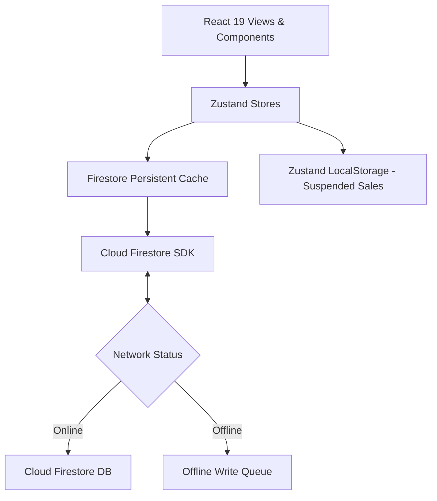
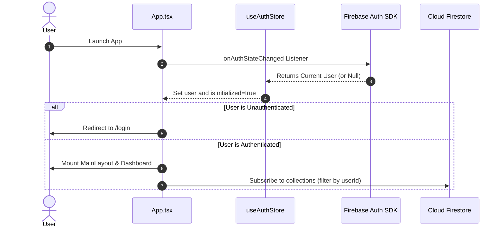

# Application Architecture

This document describes the high-level system design, rendering strategies, data flow, and core architectural components of the Dijital Stok application.

---

## 🏛️ Overall Architecture Overview

Dijital Stok is designed as a hybrid, **Offline-First Single Page Application (SPA)** that compiles down to a Progressive Web App (PWA) for modern web browsers and wraps into native packages for iOS/Android using **CapacitorJS**.



---

## 🎨 Rendering Strategy & App Shell

The application employs **Client-Side Rendering (CSR)** to achieve native-like performance and allow full offline usability. 

*   **PWA Shell:** The application bundle is precached by a Workbox-managed service worker configured via `vite-plugin-pwa`. When launched, the HTML, JS, and CSS loads immediately from the local device storage.
*   **Capacitor Native Host:** On iOS and Android, Capacitor loads the compiled client build from the device's local file system (`capacitor://localhost`), running inside a native web view.

---

## 📂 Folder Responsibilities

The codebase follows a modular, **feature-driven folder structure** rather than technical separation (e.g., controllers vs. views):

*   `src/app/`: The app shell containing routing layout bootstrap (`App.tsx`), styles, and the React entrance point (`main.tsx`).
*   `src/core/`: Central configurations including environment configurations (`core/config/env.ts`) and Firebase initialization settings (`core/firebase/config.ts`).
*   `src/features/`: Independent, self-contained business modules. Each module manages its own state, components, and views. Examples: `auth`, `inventory`, `sales`, `customers`, `sales-history`, `dashboard`.
*   `src/shared/`: Shared layout components (e.g., `MainLayout`), contexts (e.g., `ConfirmDialogContext`), custom hooks (e.g., `useGlobalBarcodeScanner`), and global UI elements (e.g., `SyncIndicator`).

---

## 🔄 Data Flow & State Management

State and data synchronization are handled using a combination of **Zustand stores** for transient UI states and **Cloud Firestore SDK** for persistent database operations.

### Real-Time & Latency Compensated Writes
When a user updates a resource (e.g., adds an inventory item):
1.  The view calls a Zustand store action (e.g., `addItem`).
2.  The store triggers a Firestore SDK operation (e.g., `setDoc`).
3.  Firestore instantly applies the write to its **Local Persistent Cache** and fires query snapshots.
4.  The snapshot listener (`onSnapshot`) captures the updated local cache immediately, updating the Zustand state (`items`), which triggers a UI re-render (this is *latency compensation*).
5.  In the background, Firestore queues the write. If online, it sends the batch to the cloud database; if offline, it waits until the network resumes.

### Store Registry
The application relies on 5 core Zustand stores:

| Store Name | File Path | Scope / Responsibility | Caching |
| :--- | :--- | :--- | :--- |
| `useAuthStore` | `features/auth/store/useAuthStore.ts` | Authenticates users, wraps session listeners, and wipes all stores upon logout. | None |
| `useInventoryStore` | `features/inventory/store/useInventoryStore.ts` | Subscribes to products real-time collections. | Firestore Cache |
| `useCustomerStore` | `features/customers/store/useCustomerStore.ts` | Tracks client card details, calculates transaction history, and records payments. | Firestore Cache |
| `useSalesStore` | `features/sales/store/useSalesStore.ts` | Handles the active sales cart, active customer, discounts, and held/suspended carts. | LocalStorage (`sales-storage`) |
| `useSalesHistoryStore` | `features/sales-history/store/useSalesHistoryStore.ts` | Fetches historical sales and cancellation logic. | Firestore Cache |

---

## 🔒 Authentication & Authorization Flow



### Data Authorization (Security Rules)
All data queries must pass through database authorization policies. The app enforces user isolation by filtering collection queries in the client by the authenticated user's ID:
```typescript
const q = query(collection(db, 'inventory'), where('userId', '==', user.uid));
```
Complementing this, the backend Cloud Firestore Security Rules enforce that no user can read or write documents where the document's `userId` field does not match the request's auth UID.

---

## ⚡ Performance and Caching Strategies

To maintain fluid frame rates and minimize network overhead, several performance decisions have been built into the system:

1.  **Firestore Offline Persistent Cache:** Enabled with `persistentLocalCache` and `persistentMultipleTabManager()`. Reads are served from local storage whenever possible, avoiding remote Firestore queries.
2.  **Zustand Persist Middleware:** Used in `useSalesStore` with `partialize` to selectively write only the `heldSales` array to `localStorage`. Active cart arrays are stored strictly in memory to prevent performance degradation from disk writes.
3.  **Lazy Loading for Camera Modal:** The `ScannerModal.tsx` contains heavy dependencies (ZXing library & MLKit barcode loaders). It is wrapped in `React.lazy` and loaded asynchronously inside `SalesView.tsx` only when the user opens the camera scanner.
4.  **Debounced Searching:** Searching in inventory tables or customer ledger lists delays queries by 300ms, preventing re-renders on every keystroke.
5.  **Optimized Calculations:** Analytical charts and calculations on the dashboard utilize React's `useMemo` hooks to avoid costly recalculations when secondary state changes.
